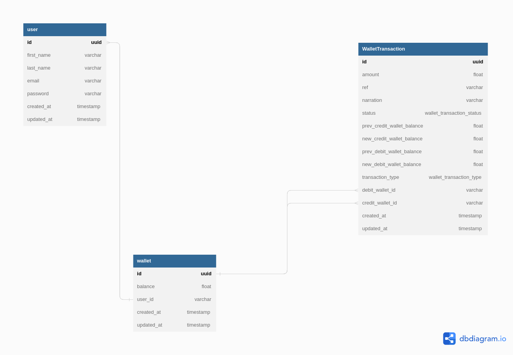

## About 

Demo Credit is a mobile lending app that requires wallet functionality. This is needed as borrowers need a wallet to receive the loans they have been granted and also send the money for repayments built with Node js, Express, TypeScript and Mysql

It has the following functionalities
* A user can create an account
* A user can fund their account
* A user can transfer funds to another user’s account

### ER diagram




## Installation

* Clone this repo

  ```bash
  git clone https://github.com/olad5/demo-credit.git
  ```

## Running the project

1. Install and start [Docker](https://docs.docker.com/compose/gettingstarted/) if you haven't already.
2. Copy the `.env` template file. Input the passwords and app secrets. 

```bash
cp .env.sample .env
```

3. Build and run the image to run the backend services.

```bash
docker compose up --build
```

4. Run migrations

```bash
  npx knex migrate:latest --knexfile=src/shared/infra/database/knex/knexfile.ts 
```

5. Seed database

```bash
  npx knex seed:run  --knexfile=src/shared/infra/database/knex/knexfile.ts  
```

You can visit the app by going to `http://localhost:5300`.


### Built with

#### Backend

- [Mysql](https://www.mysql.com/) - Database
- [Knex js](https://knexjs.org/) - The Query Builder for Node.js
- [Objection js](https://vincit.github.io/objection.js/) - The ORM for Node.js
- [Express.js](https://expressjs.com/) - Lightweight webserver
- [Redis](https://redis.io/) - For holding onto JWT tokens and refresh tokens

